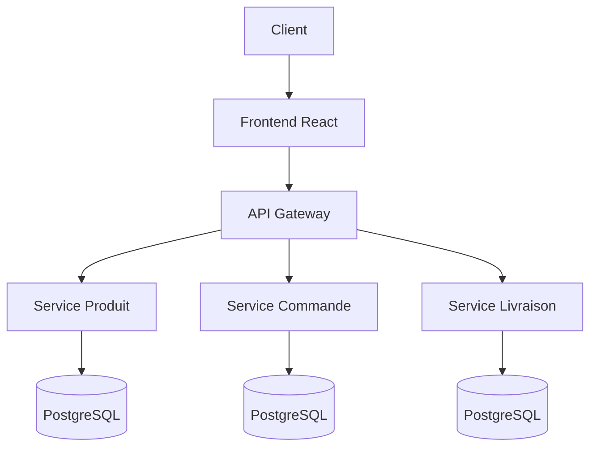

# 🏥 Pharmacy Digital - Plateforme de Gestion

Plateforme digitale complète pour la gestion d'officine pharmaceutique, automatisant les processus de gestion des stocks, commandes et livraisons.

## 🚀 Fonctionnalités Principales

### 📦 Gestion des Produits
- Catalogue produits avec gestion des stocks
- Alertes automatiques (péremption, ruptures)
- Gestion des lots et traçabilité
- Contrôle des prescriptions

### 🛒 Gestion des Commandes
- Workflow automatisé de validation
- Gestion numérique des ordonnances
- Interface client en ligne
- Suivi du statut en temps réel

### 🚚 Livraison & Suivi
- Planification optimisée des tournées
- Tracking géolocalisé
- Notifications automatiques
- Gestion des incidents

---

## 🛠️ Stack Technique

### Backend
- **Framework** : Spring Boot 3.x
- **Langage** : Java 17+
- **Base de données** : PostgreSQL
- **API** : RESTful avec OpenAPI 3.0

### Frontend
- **Framework** : React 18 + TypeScript
- **UI** : Material-UI v5
- **State Management** : Redux Toolkit

### Infrastructure
- **Conteneurisation** : Docker
- **Orchestration** : Kubernetes
- **CI/CD** : GitLab CI

---

## 📋 Prérequis
- Java 17 ou supérieur
- Node.js 18+
- PostgreSQL 14+
- Docker et Docker Compose

---

## 🏃‍♂️ Installation & Démarrage

### 1. Cloner le projet
```bash
git clone [https://github.com/your-org/pharmacy-digital.git](https://github.com/your-org/pharmacy-digital.git)
cd pharmacy-digital
```

### 2. Backend (Spring Boot)
```bash
cd backend
./mvnw clean install
./mvnw spring-boot:run
```

### 3. Frontend (React)
```bash
cd frontend
npm install
npm start
```

### 4. Avec Docker
```bash
docker-compose up -d
```

---

## 📁 Structure du Projet

```text
pharmacy-digital/
├── backend/                 # Services Spring Boot
│   ├── service-produit/
│   ├── service-commande/
│   └── service-livraison/
├── frontend/               # Application React
├── mobile/                 # Application mobile
├── docs/                   # Documentation
└── docker-compose.yml      # Environnement Docker
```

---

## 🔌 API Endpoints

| Service | Méthode | Endpoint | Description |
| :--- | :--- | :--- | :--- |
| **Produit** | `GET` | `/api/produits` | Liste des produits |
| **Produit** | `POST` | `/api/produits` | Créer un produit |
| **Produit** | `GET` | `/api/produits/alertes` | Alertes stocks |
| **Commande** | `POST` | `/api/commandes` | Passer commande |
| **Commande** | `GET` | `/api/commandes` | Historique commandes |
| **Livraison** | `GET` | `/api/livraisons/{id}/suivi` | Suivi livraison |

---

## 🏗️ Architecture



---

## 🧪 Tests

```bash
# Tests backend
./mvnw test

# Tests frontend
npm test

# Tests e2e
npm run test:e2e
```

---

## 🤝 Contribution

1. Fork le projet
2. Créer une branche feature (`git checkout -b feature/amazing-feature`)
3. Commit les changements (`git commit -m 'Add amazing feature'`)
4. Push sur la branche (`git push origin feature/amazing-feature`)
5. Ouvrir une Pull Request

---

## 📄 Licence
Ce projet est sous licence MIT. Voir le fichier `LICENSE` pour plus de détails.

---

## 👥 Équipe
* **Développement** : Équipe Technique Pharmacy Digital
* **Contact** : contact@pharmacy-digital.com

## 📞 Support
* 📧 **Email** : support@pharmacy-digital.com
* 🐛 **Issues** : GitHub Issues
* 📚 **Documentation** : Wiki du projet

_🚀 Développé avec ❤️ pour les pharmaciens_
